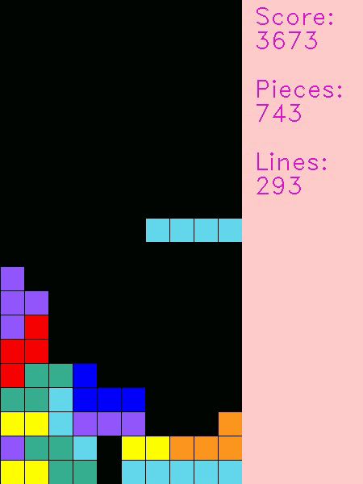
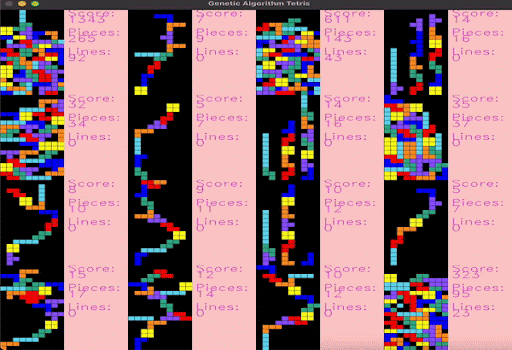
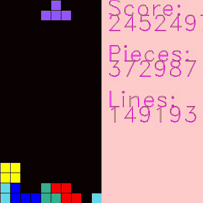

# Mastering Tetris: AI Agent Training for Complex Decision-Making

## Project Overview
This project focuses on developing AI agents capable of mastering Tetris through advanced reinforcement learning and evolutionary algorithms. Our work explores two primary approaches: **Deep Q-Networks (DQN)** and **Genetic Algorithms (GA)**, with an experimental attempt at **Proximal Policy Optimization (PPO)**.

The AI agents are trained to optimize gameplay, clear lines efficiently, and achieve high scores, showcasing complex decision-making and strategic evolution over time.

---

## Tetris Environment
`tetris.py`  
- Adapted from an open-source Tetris environment ([source](https://github.com/vietnh1009/Tetris-deep-Q-learning-pytorch)).  
- **Modifications**:  
  - Reward system changed to linear line-clearing rewards (original was quadratic).  
  - Enhanced state space to increase complexity and improve learning potential.  
  - Environment restructured to accommodate **population-based approaches** in GA.  

---

## DQN Implementation
All DQN-related code is organized within the `dqn` directory and implemented in `dqn.ipynb`.

| Class/Function  | Description  |
|-----------------|---------------------------------------------------------------------------------------------------------------------------------------------------|
| `DQN`           | PyTorch neural network with three sequential layers using ReLU activation and batch normalization. Xavier initialization is applied to the weights. Two versions exist: one for 4-feature environments (size 64) and one for 8-feature environments (size 128).|
| `train`         | Implements the epsilon-greedy policy to balance exploration and exploitation. Utilizes experience replay and trains the model after accumulating 30,000 experiences over 3,000 games.|
| `record_game`   | Records gameplay using the trained model and outputs the video using OpenCV. |
| `evaluate_model`| Evaluates the model’s performance over multiple games, providing average scores, lines cleared, and tetrominoes survived. |

---

## Genetic Algorithm Implementation
All GA-related code resides in the `genetic_algorithm` directory.

| File Name              | Description  |
|-----------------------|---------------------------------------------------------------------------------------------------------------------------------------------------|
| `agent_genetic.py`     | Defines the `GeneticAgent` class, representing individual agents within the population. Agents utilize weight vectors to decide states and actions. |
| `genetic_algorithm.py` | Contains the main `GeneticAlgorithm` class. Implements crossover, mutation, and elitism for evolving populations. Key methods include `crossover()` and `mutate()`. |
| `run_genetic.py`       | Main loop for running and evolving the genetic algorithm. Tracks generation fitness and visualizes results. Saves the top-performing agent via pickle. |
| `run_best_agent.py`    | Tests the best agent after training, visualizes gameplay, and saves recordings as MP4 videos. |

---

## PPO (Experimental)
- **Directory**: `ppo`  
- **Description**: Initial attempt to train PPO models for Tetris, implemented in `ppo.ipynb`. Due to time constraints and limited resources, this approach remains incomplete but serves as a foundation for future exploration.

---

## Results
### DQN Gameplay
Here is the gameplay of the DQN model in action using a linear scoring, achieving high scores through reinforcement learning strategies:

### Genetic Algorithm (GA) Gameplay
The genetic algorithm showcases its evolutionary approach, leading to high scores and adaptable gameplay with a population:

  
Here is the GA best agent scoring a high score:  

- **Genetic Algorithm (GA)**: Achieved a record score of **10 million** through adaptive evolution strategies.  
- **Deep Q-Network (DQN)**: Achieved a score of **4 million** with expanded state observations and optimized neural networks.  
- **PPO**: Work in progress with potential for future development.

---

## Key Contributions
- **Algorithm Development**:  
   - Designed and tuned DQN and GA models.  
   - GA leveraged crossover, mutation, and elite selection strategies.  
   - DQN utilized epsilon-greedy exploration, experience replay, and PyTorch neural networks.  
- **Hyperparameter Tuning**:  
   - GA: Mutation rate (10%), crossover rate (70%), elite fraction (20%), population size (16).  
   - DQN: Experimented with reward functions and feature set expansions (4 to 8 features).  
- **Environment Modification**:  
   - Modified Tetris environment to align with the needs of GA and DQN, enhancing learning efficiency.  
- **Visualization and Analysis**:  
   - Gameplay efficiency and fitness trends visualized using Matplotlib.  

---

## Research Paper
A detailed research paper documenting the project, methods, and results is available in the [`docs`](docs) directory.   
📄 [Read the Full Paper](docs/TetrisAI_Research_Paper.pdf)

---

## Disclaimer
This project builds upon the open-source Tetris implementation by [vietnh1009](https://github.com/vietnh1009/Tetris-deep-Q-learning-pytorch). Some models utilize a modified version of `tetris.py`, which is not directly included in this repository to avoid confusion. Full credit to the original author.

---

## How to Run the Project
1. Clone the repository.  
2. Install dependencies listed in `requirements.txt`.  
3. Run `run_genetic.py` or `dqn.ipynb` to start training.  

---

## Future Work
- Extend PPO implementation.  
- Fine-tune hyperparameters and model architectures.  
- Explore hybrid approaches combining GA with DQN for enhanced performance.
